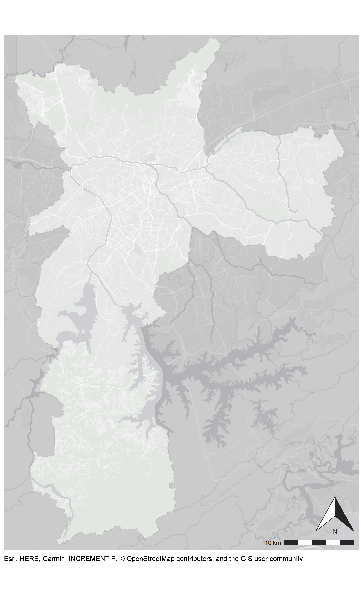
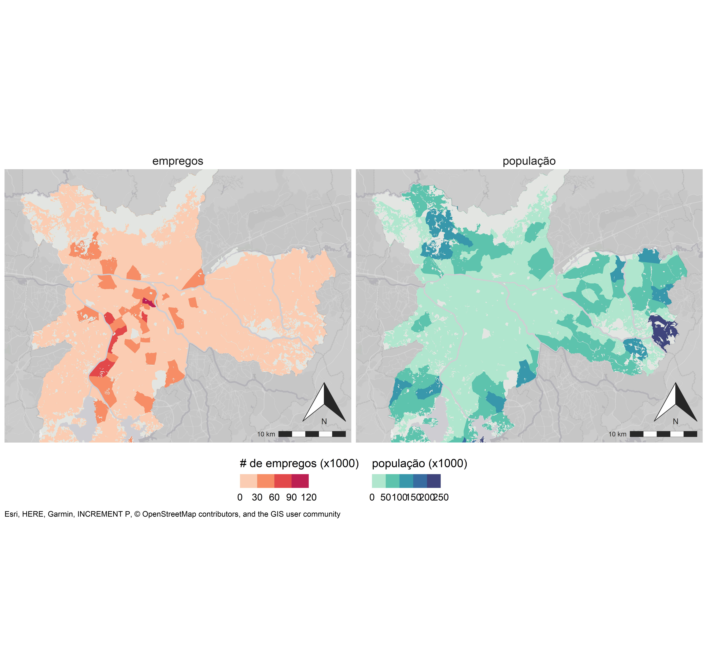
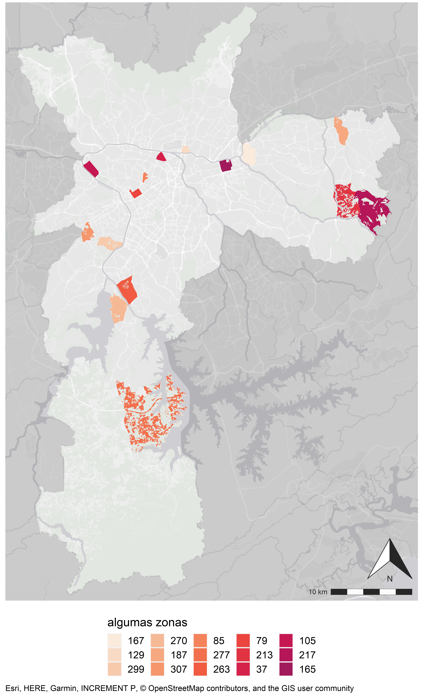

# Configurações iniciais

```{r setup, echo = F}
knitr::opts_chunk$set(warning = FALSE, 
                      message = FALSE,
                      dpi = 300, 
                      dev.args = list(type = "cairo")) 

knitr::knit_hooks$set(inline = function(x) {
  prettyNum(x, big.mark=".", decimal.mark = ',')
})
```

Para plotar os mapas eu uso essencialmente estas bibliotecas.
```{r libraries}
# carrega as bibliotecas principais para processamento e visualização
library(tidyverse)
# manipulação de shp e visualização
library(sf)
# leitura de figura em png (para usar o fundo de SP nos mapas)
library(png)
# adição de mais um layer na visualização com o mesmo tipo (fill, color ou shp...)
library(ggnewscale)
# também uso ggspatial para pegar o fundo da imagem e aplicar a escala
library(ggspatial)
# paleta padrão
library(viridis)
```

Configurações de plotagem que uso por padrão. Dependendo do gráfico ou mapa é possível sobrescrever essas configurações (principalmente adicionar as de temas).
```{r chart settings}
# tamanho padrão ----
base <- 297 # tamanho base para altura das imagens

# tamanho da fonte e linha proporcional à altura da página
font.size <- 4.23*ggplot2::.pt # 4.23 mm é mais ou menos 12pt
txt.size <- font.size
title.size <- txt.size*1.2
cap.size <- txt.size*0.8

line.size <- 0.25*ggplot2::.stroke

# sugestão de proporção das dimensões das figuras para salvar
map_dim <- data.frame(map = c(1, 2, 3, 4, 5, 8, 'chart','3_short', 'chart_short'),
                      height = base,
                      width = base/c(1.65, 0.9 ,0.65, 0.55, 0.46, 0.85, 0.45, 0.95, 0.1125))

# definições espaciais ----

# CRS mais usados dos shapefiles que carrego
crsutm <- 32723 # WGS84 UTM 23S
crsutm_sirgas <- 31983 # SIRGAS2000 UTM 23S
crsdegrees <- 4326 # degrees

# delimitação da área de plot espacial em relação a SP ----
# município inteiro
coord_lim <- coord_sf(ylim = c(7346293.52,7413300.44), 
                      xlim = c(314223.75, 360463.96),
                      crs = crsutm) 
# parte do muniípio
coord_lim_short <- coord_sf(xlim = c(-46.826081, -46.365377), 
                            ylim = c(-23.716492, -23.384091),
                            crs = crsdegrees)

# opções de background ----
## download da base usando ggspatial
## busca no arquivo que criei com tipos de fundos o fundo escolhido
## costumo usar o da ESRI e sempre coloco um caption sobre de onde veio
bg_options <- read.csv2('background_map_tiles.csv', stringsAsFactors = F)
basemap_option <- 'esri-light-gray' # basemap
bg <- bg_options[bg_options$option==basemap_option,]
## a partir do ggspatial, baixo os tiles para montar o fundo e salvar para usar em outros mapas
# p <- ggplot() +
#    ggspatial::annotation_map_tile(type = bg$link, 
#                                   zoom = 12,
#                                   quiet = T,
#                                   progress = 'text')+ 
#    coord_lim_short +
#    theme_void()
# ggsave('data/basemap_short_esri_light_gray_12.png', 
#        p, dpi = 500, width = 7, height = 4, 
#        units = "in", type = 'cairo-png')

# leitura do fundo com SP cortada
basemap <- png::readPNG('data/basemap_short_esri_light_gray_12.png')
ggbasemap_short <- grid::rasterGrob(basemap, interpolate = T)
# leitura do fundo com SP inteira
basemap <- png::readPNG('data/basemap_esri_light_gray_12.png')
ggbasemap <- grid::rasterGrob(basemap, interpolate = T)
# remove o png
rm(basemap)
gc()

# definições de norte e escala ----
norte <-   ggspatial::annotation_north_arrow(location = 'br',
                                             height = unit(.75, "in"),
                                             width = unit(.75, "in"),
                                             pad_y = unit(.75, "cm"),
                                             style = north_arrow_orienteering(
                                               line_width = 1,
                                               line_col = "grey15",
                                               fill = c("white", "grey15"),
                                               text_col = "grey15",
                                               text_family = "",
                                               text_face = NULL,
                                               text_size = 8,
                                               text_angle = 0
                                             )) 

escala <- ggspatial::annotation_scale(location = 'br', 
                                      height = unit(0.25, "cm"),
                                      bar_cols = c('grey15', 'grey99'), 
                                      line_width = 0.3,
                                      line_col = 'grey15',
                                      text_col = 'grey15')

# temas padrão para gráficos e mapas ----
# estes temas eu coloco logo ao final de todo plot
# padrão de gráficos
theme_chart <- theme_bw() +
  theme(panel.border = element_blank(),
        panel.spacing = unit(2, 'mm'),
        # axis
        axis.line = element_line(color='grey30'),
        axis.ticks = element_line(color='grey30'),
        axis.text = element_text(size = txt.size),
        axis.title = element_text(size = title.size),
        # legend
        legend.position = 'bottom',
        legend.text = element_text(size=txt.size),
        legend.title = element_text(size=title.size),
        legend.spacing.x = unit(.01,"cm"),
        # strip
        strip.background = element_blank(),
        strip.text = element_text(size = title.size),
        # margin
        plot.margin = margin(2, 2, 2, 2, 'mm'))

# padrão de mapas
theme_map <- theme(
  # axis
  axis.line = element_blank(),
  axis.ticks = element_blank(),
  axis.text = element_blank(),
  axis.title = element_blank(),
  # facet grid
  panel.grid = element_line(color="#CFCED3"),
  panel.spacing = unit(2,'mm'),
  # legend
  legend.position = "bottom",
  legend.box = "horizontal",
  legend.direction = "horizontal",
  legend.spacing = unit(2, "mm"),
  legend.text = element_text(size=txt.size),
  legend.title = element_text(size=title.size),
  # facet
  strip.background = element_blank(), 
  strip.text = element_text(size = title.size),
  # background
  panel.background = element_rect(fill="#CFCED3"),
  plot.background = element_blank(),
  # caption
  plot.caption = element_text(size = cap.size,
                              hjust = 0),
  plot.caption.position = "panel",
  # margin,
  plot.margin = margin(1, 1, 1, 1, 'mm'))
```


# Paleta de cores
```{r color pallete}
# cores para água e para áreas verdes
colWater <- "#CFCED3" 
colGreen <-  "#E2E7E1"

# cor de ciclovia
ciclovia_cor <- "grey20" # usei esta cor nos plots abaixo para testar o cotraste com as paletas e parece que o único problema seria o azul mais escuro

```

Deixei com duas opções as escalas graduais, uma vermelha (baseada na viridis `rocket`) e outra azul (baseada na viridis `mako`), mas é bom vocês conversarem entre si sobre qual vai ser o padrão que vão usar (vermelho para quanto mais vermelho, pior, ou azul para piores valores). Para as duas a escala começa deois `begin = 0.4` para evitar as cores muito escuras. 

Ainda, as paletas são uma função que depende da quantidade de cores que querem e da direção que querem que comece . O padrão que deixei é sempre começar da cor mais clara para a mais escura (`direction = -1`), mas se quiserem que o valor mais baixo comece com a cor mais escura, é só colocar `direction = 1`.

```{r paletas graduais, fig.width= 7, fig.height= 3}
# escala gradual crescente vermelha
pal_red <- function(n, direction = -1){rocket(n, begin = 0.4, direction = direction)}

# paleta crescente azul
pal_blue <- function(n, direction = -1){mako(n, begin = 0.25, direction = direction)}


# demonstração das cores
tibble(x = 1:5,
       y = 1,
       col = pal_blue(5),
       paleta = 'azul') %>% 
  bind_rows(tibble(x = 1:5,
                   y = 1,
                   col = pal_red(5),
                   paleta = 'vermelha, direction = -1')) %>% 
  bind_rows(tibble(x = 1:5,
                   y = 1,
                   col = pal_red(5, direction = 1),
                   paleta = 'vermelha, direction = 1')) %>% 
  ggplot() +
  geom_tile(aes(x, y, fill = col), show.legend = F) +
  geom_text(aes(x, y, label = col), color = ciclovia_cor, angle = 90)+
  scale_fill_manual(values = c(pal_blue(5),pal_red(5),pal_red(5, direction = 1)),
                    breaks = c(pal_blue(5),pal_red(5),pal_red(5, direction = 1)))+
  facet_grid(.~paleta)+
  theme_chart
```
Para a escala divergente, eu juntei as duas paletas (azul e vermelha) em uma. Existe a possibilidade de trabalhar com números ímpares ou pares de cor. 

```{r paleta divergente, fig.width= 7, fig.height= 3}
# escala gradual divergente (junção de duas paletas do viridis) - não é o ideal para usar
pal_div<- function(n){
  if (n%%2 == 1){ #  n é impar
    n <- (n-1)/2
    div <- c(rocket(n, begin = 0.4, end = 1 - 0.6/n), # paleta vermelha
             "#EBE6D3", # intermediária
             mako(n, begin = 0.25, end = 1-0.75/n, direction = -1)) # paleta azul
  } else{ # n é par e não precisa da intermediária
    n <- n/2
    div <- c(rocket(n, begin = 0.4, end=.95), # paleta vermelha
             mako(n, begin = 0.25, direction = -1)) # paleta azul
  }
  div
}

# demonstração das cores
tibble(x = 1:9,
       y = 1,
       col = pal_div(9),
       paleta = "ímpar") %>% 
  bind_rows(tibble(x = 1:10,
                   y = 1,
                   col = pal_div(10),
                   paleta = "par")) %>% 
  ggplot() +
  geom_tile(aes(x, y, fill = col), show.legend = F) +
  geom_text(aes(x, y, label = col), color = ciclovia_cor, angle = 90)+
  scale_fill_manual(values = c(pal_div(9),pal_div(10)),
                    breaks = c(pal_div(9),pal_div(10)),)+
  facet_wrap(.~paleta)+
  theme_chart
```
Outro ponto importante para ter cuidado com os plots de mapas na cartografia é a quantidade de cores selecionadas. Sempre é melhor trabalhar com faixas ao invés de gradientes, assim fica mais fácil para identificar qual é a cor e o valor referente à área. Além disso, também para facilitar a identificação das cores/valores, sugiro trabalhar com menos de 7 categorias (para mim o ideal é 5).


# Carregando arquivos 

Arquivos base 
```{r loading data}
# outros municípios além de SP para gerar a máscara
muni <- sf::st_read("data/shp/Outros_muni-MSP.shp", quiet=T, crs=crsutm) %>% 
  sf::st_transform(crs = crsdegrees) 
massa <- sf::st_read("data/shp/Massa_dagua_MSP.shp", quiet=T, crs = crsutm_sirgas) %>% 
  sf::st_transform(crs = crsdegrees)  
rios <- sf::st_read("data/shp/Rio_MSP.shp", quiet=T, crs=crsutm_sirgas) %>% 
  sf::st_transform(crs = crsdegrees) 
verde <- sf::st_read("data/shp/Verde_MSP.shp", quiet=T, crs=crsutm_sirgas) %>% 
  sf::st_transform(crs = crsdegrees)
```
Arquivos de interesse. Estou usando uma base de empregos por Zona OD de 2007 que eu tinha pronta aqui de um outro tutorial.

```{r loading main files}
zona_emp <-  sf::st_read("data/Zona2007_empregos.shp") %>% 
  filter(Municipio == 36) # só para pegar SP
```

# Fazendo os mapas

Como havia comentado, tem duas opções de enquadramento dos mapas. O padrão que uso é:

* figura base do ArcGis para usar de fundo com algumas coisas do entorno de São Paulo;
* layer de interesse;
* layer de áreas verdes;
* layer de massa d'água;
* layer da máscara dos municípios do entorno para dar destaque ao município de SP.

```{r base to plot maps}

# mapa padrão
p <- ggplot() +
  # bg 
  annotation_custom(ggbasemap, xmin=-Inf, xmax = Inf, ymin = -Inf, ymax = Inf) +
  # adicionar o layer de interesse aqui
  #base maps
  geom_sf(data=verde, fill=colGreen, color="transparent") +
  geom_sf(data = massa, fill = colWater, color = colWater, size = line.size/2)  +
  geom_sf(data=rios, color=colWater, size=line.size) +
  geom_sf(data=muni, fill = 'grey40', color = 'transparent', alpha = 0.25) +
  labs(caption = bg$caption) +
  escala +
  norte +
  coord_lim +
  theme_map 

# salvar em alta qualidade
width <- dplyr::filter(map_dim, map=='1')$width # como só tem um mapa, coloco 1 em map
ggsave('figuras/mapa_base.png', 
       p, dpi = 500, width = width, height = base, 
       units = "mm", type = 'cairo-png')
```

```{r, echo=FALSE, out.height="25%"}

```

```{r ex base to plot maps}
# incluindo alguma informação ao mapa base

# separei em dois bds só para colocar o exemplo da inclusão de dois mapas com paletas diferentes em um mesmo plot
df1 <- zona_emp %>% 
  rename(values = empregos) %>% 
  mutate(var = "empregos")

df2 <- zona_emp %>% 
  rename(values = pop) %>% 
  mutate(var = "população")

p <- ggplot() +
  # bg 
  annotation_custom(ggbasemap, xmin=-Inf, xmax = Inf, ymin = -Inf, ymax = Inf) +
  # adicionar o layer de interesse aqui
  geom_sf(data = df1, aes(fill=values), color = "transparent") +
  scale_fill_stepsn('# de empregos (x1000)',
                    colors = pal_red(5), # número de cores deve ser igual ao número de breaks
                    n.breaks = 5,
                    labels = function(x){x/1000}, #para deixar na base 1000
                    guide = guide_colorsteps(show.limits=T,
                                             title.position = 'top',
                                             order = 2))+
  # adicionando uma nova camada
  new_scale_fill() +
  geom_sf(data = df2, aes(fill=values), color = "transparent") +
  scale_fill_stepsn('população (x1000)',
                    colors = pal_blue(5),
                    n.breaks = 5,
                    labels = function(x){x/1000},
                    guide = guide_colorsteps(show.limits=T,
                                             title.position = 'top',
                                             order = 2))+
  #base maps
  geom_sf(data=verde, fill=colGreen, color="transparent") +
  geom_sf(data = massa, fill = colWater, color = colWater, size = line.size/2)  +
  geom_sf(data=rios, color=colWater, size=line.size) +
  geom_sf(data=muni, fill = 'grey40', color = 'transparent', alpha = 0.25) +
  facet_grid(.~var) +
  labs(caption = bg$caption) +
  escala +
  norte +
  coord_lim +
  theme_map 

# salvar em alta qualidade
width <- dplyr::filter(map_dim, map=='2')$width # como tem 2 mapas, coloco 2 em map
ggsave('figuras/mapa_aplicação.png', 
       p, dpi = 500, width = width, height = base, 
       units = "mm", type = 'cairo-png')
```
```{r, echo=FALSE, out.height="25%"}
knitr::include_graphics('figuras/mapa_aplicação.png')
```


Mapa menor
```{r ex base to plot maps - short}
p <- ggplot() +
  # bg 
  annotation_custom(ggbasemap_short, xmin=-Inf, xmax = Inf, ymin = -Inf, ymax = Inf) +
  # adicionar o layer de interesse aqui
  geom_sf(data = df1, aes(fill=values), color = "transparent") +
  scale_fill_stepsn('# de empregos (x1000)',
                    colors = pal_red(5),
                    n.breaks = 5,
                    labels = function(x){x/1000}, #para deixar na base 1000
                    guide = guide_colorsteps(show.limits=T,
                                             title.position = 'top',
                                             order = 2))+
  # adicionando uma nova camada
  new_scale_fill() +
  geom_sf(data = df2, aes(fill=values), color = "transparent") +
  scale_fill_stepsn('população (x1000)',
                    colors = pal_blue(5),
                    n.breaks = 5,
                    labels = function(x){x/1000},
                    guide = guide_colorsteps(show.limits=T,
                                             title.position = 'top',
                                             order = 2))+
  #base maps
  geom_sf(data=verde, fill=colGreen, color="transparent") +
  geom_sf(data = massa, fill = colWater, color = colWater, size = line.size/2)  +
  geom_sf(data=rios, color=colWater, size=line.size) +
  geom_sf(data=muni, fill = 'grey40', color = 'transparent', alpha = 0.25) +
  facet_grid(.~var) +
  labs(caption = bg$caption) +
  escala +
  norte +
  coord_lim_short +
  theme_map 

# salvar em alta qualidade
width <- dplyr::filter(map_dim, map=='3_short')$width # short não tem muitas definições
ggsave('figuras/mapa_aplicação_short.png', 
       p, dpi = 500, width = width, height = base, 
       units = "mm", type = 'cairo-png')
```

```{r, echo=FALSE, out.height="25%"}

```

Mapa com escala discreta. Detalhe que as cores na função `scale_*_manual` entram no atributo `values`. Diferente da  função `scale_*_stepsn()`, em que as cores entram como `colors`.

```{r ex base discreta plot maps}
# incluindo alguma informação ao mapa base
set.seed(1)
zonas <- sample(1:320, 15)

p <- ggplot() +
  # bg 
  annotation_custom(ggbasemap, xmin=-Inf, xmax = Inf, ymin = -Inf, ymax = Inf) +
  # adicionar o layer de interesse aqui
  geom_sf(data = filter(zona_emp, Zona07 %in% zonas), aes(fill=Zona07), color = "transparent") +
  scale_fill_manual('algumas zonas',
                    breaks = zonas,
                    values = pal_red(15), 
                    guide = guide_legend(show.limits=T,
                                             title.position = 'top',
                                             order = 2))+
  #base maps
  geom_sf(data=verde, fill=colGreen, color="transparent") +
  geom_sf(data = massa, fill = colWater, color = colWater, size = line.size/2)  +
  geom_sf(data=rios, color=colWater, size=line.size) +
  geom_sf(data=muni, fill = 'grey40', color = 'transparent', alpha = 0.25) +
  labs(caption = bg$caption) +
  escala +
  norte +
  coord_lim +
  theme_map 

# salvar em alta qualidade
width <- dplyr::filter(map_dim, map=='1')$width # como tem 2 mapas, coloco 2 em map
ggsave('figuras/mapa_zonas_discreto.png', 
       p, dpi = 500, width = width, height = base, 
       units = "mm", type = 'cairo-png')
```
```{r, echo=FALSE, out.height="25%"}

```